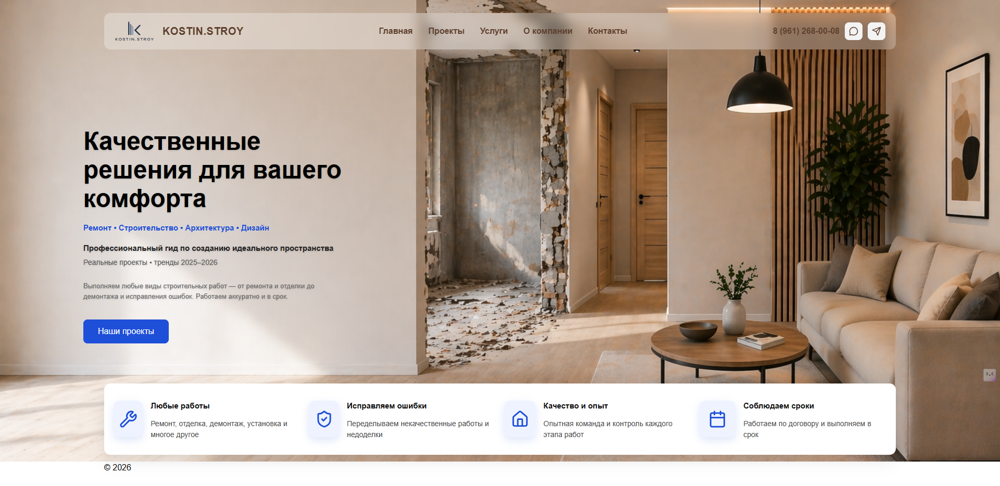
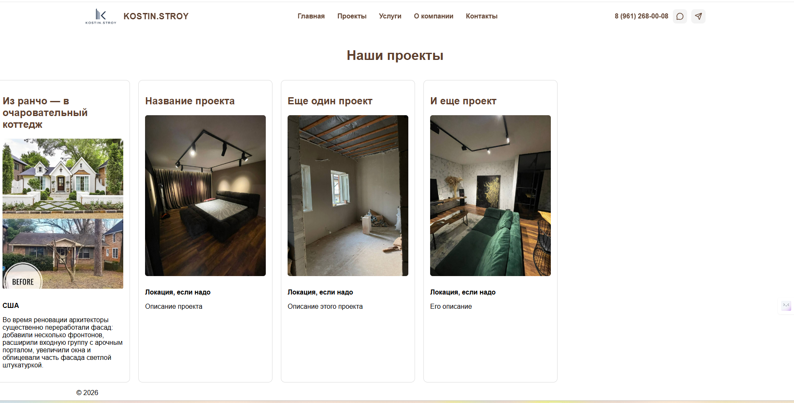

# 🏗️ KOSTIN.STROY — Сайт строительной компании

Веб-приложение-портфолио для строительной компании, реализованное на Django.
Сайт демонстрирует проекты, услуги и преимущества компании с адаптивным интерфейсом.

---

## 🚀 Функционал

* 📌 Главная страница с презентацией компании
* 🧱 Блок преимуществ (адаптивная сетка)
* 🏠 Раздел проектов с карточками
* 📷 Загрузка и отображение изображений (Django Media)
* 📱 Адаптивная верстка (desktop / tablet / mobile)
* 🍔 Бургер-меню для мобильных устройств

---

## 🛠️ Стек технологий

* Python 3.12
* Django
* HTML5 / CSS3
* SQLite
* JavaScript
* Lucide Icons

---

## 📂 Структура проекта

```
building_company/
├── config/
├── projects/
├── core/
├── templates/
├── static/
├── media/
├── manage.py
└── requirements.txt
```

---

## 🌐 Демо

*(планируется после деплоя)*

---

## 📸 Скриншоты

<p align="center">
  
  
</p>

*(позже можно изменить)*

---

## 💡 Особенности

* Проект выполнен как сайт-портфолио для строительной компании
* Упор на чистую верстку и UX
* Реализована адаптивность под разные устройства
* Используется Django Admin для управления контентом

---

## ⚙️ Запуск проекта

```bash
git clone https://github.com/zvezda1207/building_company.git
cd building_company

python -m venv venv
venv\Scripts\activate

pip install -r requirements.txt

python manage.py migrate
python manage.py runserver
```

---

## 📌 Автор

Irina Tka4eva
